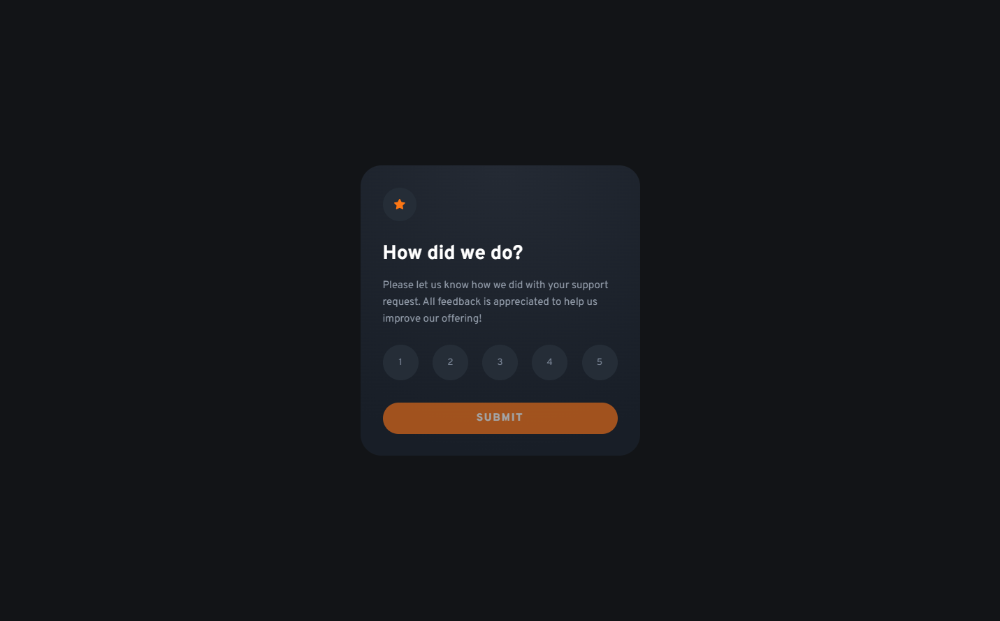
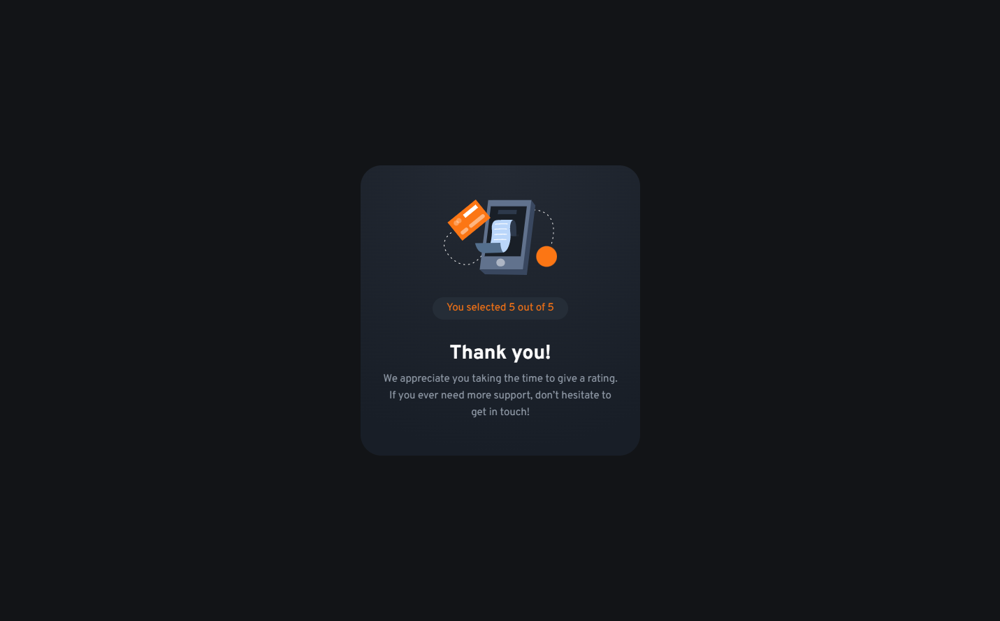
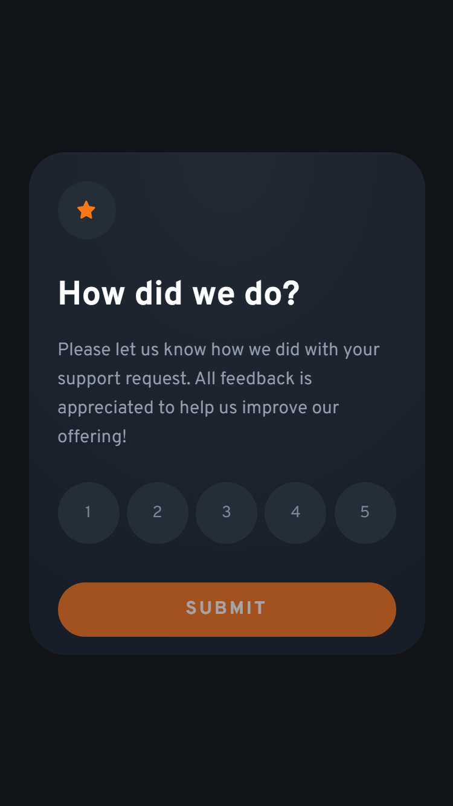
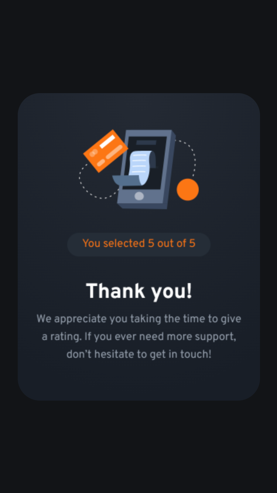

# Frontend Mentor - Interactive rating component solution

This is a solution to the [Interactive rating component challenge on Frontend Mentor](https://www.frontendmentor.io/challenges/interactive-rating-component-koxpeBUmI). Frontend Mentor challenges help you improve your coding skills by building realistic projects. 

## Table of contents

- [Overview](#overview)
  - [The challenge](#the-challenge)
  - [Screenshot](#screenshot)
  - [Links](#links)
- [My process](#my-process)
  - [Built with](#built-with)
  - [What I learned](#what-i-learned)
- [Author](#author)

## Overview

### The challenge

Users should be able to:

- View the optimal layout for the app depending on their device's screen size
- See hover states for all interactive elements on the page
- Select and submit a number rating
- See the "Thank you" card state after submitting a rating

### Screenshot

#### Desktop View

#### Mobile View

### Links

- Solution URL: [Solution](https://www.frontendmentor.io/solutions/rating-card-component-using-reactjs-HkYvRhmE5)
- Live Site URL: [Demo](https://feedback-card.netlify.app/)

## My process

### Built with

- [React](https://reactjs.org/) - JS library
- [Sass](https://sass-lang.com/) - CSS preprocessor

### What I learned

I learnt how to flip a card using css. That was the main goal of this project for me, to provide a very user friendly UI and interactions.

## Author

- Website - [Asidipta Chaudhuri](https://portfolio-asi309.vercel.app/)
- Frontend Mentor - [@asi309](https://www.frontendmentor.io/profile/asi309)

